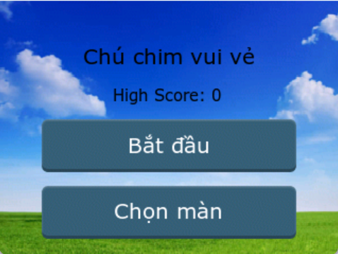
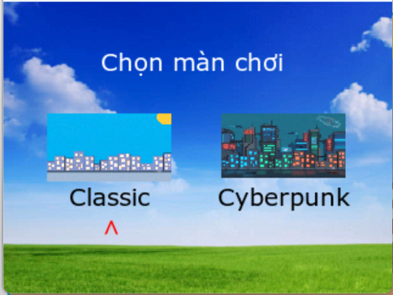
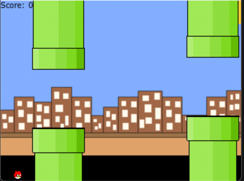
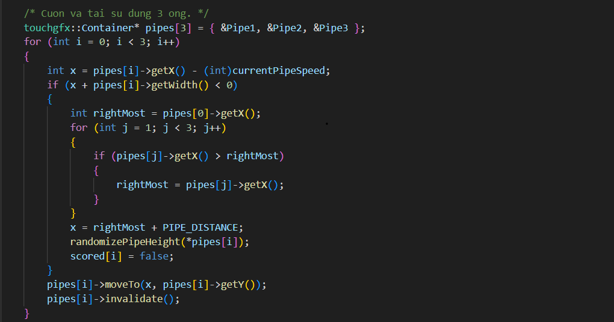
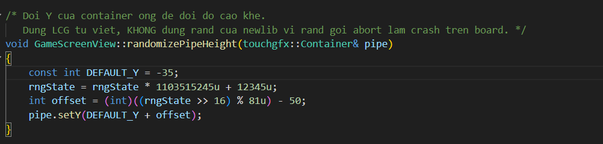
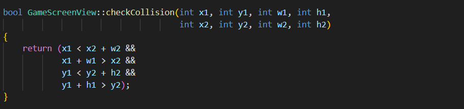
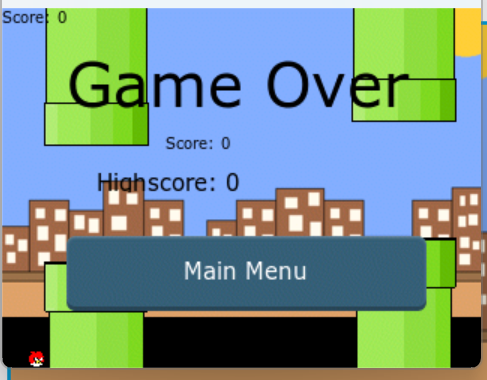
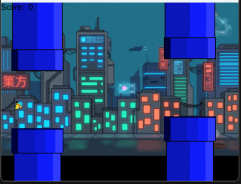
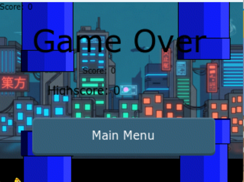

# BÁO CÁO BÀI TẬP LỚN

**Môn học:** IT4210 – Hệ nhúng

**ĐỀ TÀI:** XÂY DỰNG TRÒ CHƠI FLAPPY BIRD TRÊN KIT STM32F429

**Sinh viên thực hiện:**

| STT | Họ và tên | Mã số sinh viên |
| :---: | :--- | :--- |
| 1 | Nguyễn Duy Quang | 20225152 |
| 2 | Trần Phương Nam | 20225146 |
| 3 | Nguyễn Bùi Hoàng | 20225129 |
| 4 | Ma Đức Hưng | 20225326 |
| 5 | Nguyễn Đức Anh | 20235261 |

**Hà Nội, tháng 7 năm 2026**

---

## Mục lục
1. [GIỚI THIỆU ĐỀ TÀI](#1-giới-thiệu-đề-tài)
2. [KIẾN TRÚC PHẦN CỨNG](#2-kiến-trúc-phần-cứng)
3. [THIẾT KẾ PHẦN MỀM](#3-thiết-kế-phần-mềm)
4. [TỔNG KẾT VÀ ĐÁNH GIÁ](#4-tổng-kết-và-đánh-giá)

---

## 1. GIỚI THIỆU ĐỀ TÀI

### 1.1 Mô tả đề tài

Trong bối cảnh công nghệ hiện nay, việc thiết kế và phát triển các hệ thống nhúng đòi hỏi sự kết hợp chặt chẽ giữa phần cứng xử lý tốc độ cao và phần mềm quản lý thời gian thực. Đề tài này tập trung vào việc nghiên cứu và ứng dụng các kỹ thuật lập trình nhúng nâng cao thông qua việc xây dựng một bản sao của trò chơi Flappy Bird trên nền tảng vi điều khiển STM32F429 (cụ thể là bộ kit STM32F429I-DISC1). Hệ thống tận dụng tối đa các ngoại vi tích hợp sẵn, đặc biệt là màn hình LCD TFT 320x240 để kết xuất đồ họa và nút nhấn vật lý User Button (PA0) làm thiết bị đầu vào duy nhất.

Về mặt phần mềm, giao diện và luồng xử lý hình ảnh của trò chơi được phát triển dựa trên framework TouchGFX (phiên bản 4.26.1). Toàn bộ kiến trúc mã nguồn tuân thủ mô hình Model-View-Presenter (MVP), giúp tách biệt rõ ràng giữa lớp dữ liệu trạng thái (Model), giao diện hiển thị (View) và lớp điều khiển trung gian (Presenter). Thiết kế này không chỉ giúp quản lý mã nguồn gọn gàng mà còn tạo tiền đề tốt cho việc mở rộng tính năng mà không làm phá vỡ logic cốt lõi.

Hệ thống tích hợp hệ điều hành thời gian thực FreeRTOS (CMSIS-OS2) để phân bổ tài nguyên đa nhiệm. Thao tác điều khiển của người chơi được tiếp nhận hoàn toàn thông qua cơ chế ngắt ngoài (EXTI0) kết hợp với cờ trạng thái (`volatile flags`). Cơ chế này đảm bảo trò chơi phản hồi real-time với độ trễ cực thấp.

Bên cạnh đó, đề tài cũng đi sâu vào việc giải quyết các bài toán đặc thù của vi điều khiển như giới hạn bộ nhớ (RAM/Flash). Các kỹ thuật như Object Pooling (tái sử dụng đối tượng chướng ngại vật), xử lý chống nhiễu nút bấm cơ học (debounce) bằng phần mềm, và tự tối ưu hóa thuật toán sinh số ngẫu nhiên (LCG) để tránh lỗi tràn bộ nhớ từ thư viện chuẩn đều được nghiên cứu và áp dụng thành công.

### 1.2 Phân công nhiệm vụ

| STT | Họ và tên | Nhiệm vụ đảm nhiệm |
| :---: | :--- | :--- |
| 1 | Trần Phương Nam | Xây dựng logic game, xử lý va chạm và tính điểm, cấu hình ngắt và xử lý high score. |
| 2 | Nguyễn Bùi Hoàng | Thiết kế và lắp mạch cho còi Buzzer, xử lý logic cho còi  |
| 3 | Nguyễn Duy Quang | Viết báo cáo, xử lý chuyển màn  |
| 4 | Ma Đức Hưng | Tìm hiểu và lên ý tưởng game, thiết kế giao diện. |
| 5 | Nguyễn Đức Anh | Tìm và vẽ các thành phần giao diện |

---

## 2. KIẾN TRÚC PHẦN CỨNG

### 2.1 Thành phần hệ thống
Hệ thống được phát triển trên bộ Kit STM32F429I-DISC1.

| Thành phần | Chức năng |
| :--- | :--- |
| **Kit STM32F429I-DISC1** | Bo mạch chính, chứa vi điều khiển STM32F429ZI (ARM Cortex-M4, 180 MHz). |
| **Màn hình LCD TFT (320x240)** | Hiển thị giao diện đồ họa TouchGFX. Sử dụng giao tiếp SPI/LTDC. |
| **Nút nhấn User (PA0)** | Đầu vào duy nhất của người chơi, được cấu hình ngắt EXTI0 cạnh lên. |
| **Còi Active Buzzer (PE6)** | Thiết bị đầu ra âm thanh, được điều khiển bằng GPIO để phát tín hiệu báo khi chim vỗ cánh, ghi điểm hoặc trò chơi kết thúc. |

### 2.2 Sơ đồ kết nối và Cấu hình chân (Pinout)
*   **PA0:** Cấu hình `GPIO_EXTI0`, chế độ `Rising edge`, có điện trở kéo xuống (`Pull-down`). Nút này được sử dụng để điều hướng menu và điều khiển chim vỗ cánh.
*   **LTDC & DMA2D:** Các ngoại vi phần cứng được cấu hình qua STM32CubeMX để hỗ trợ render đồ họa xuất ra màn hình.
*   **PE6:** Cấu hình `GPIO_Output`, mức mặc định ban đầu là `Low`. Chân này dùng để điều khiển còi Active Buzzer. Khi có sự kiện âm thanh, chương trình đưa chân PE6 lên mức `High` để bật còi, sau đó tự động kéo về `Low` để tắt còi.

---

## 3. THIẾT KẾ PHẦN MỀM

### 3.1 Thiết kế giao diện bằng TouchGFX
TouchGFX là một nền tảng phát triển giao diện đồ họa (GUI) dành cho các vi điều khiển STM32, cho phép xây dựng các giao diện trực quan với hiệu suất cao, đồng thời hỗ trợ mô hình lập trình Model-View-Presenter (MVP). Trong dự án này, mô hình MVP giúp tách biệt hoàn toàn phần hiển thị giao diện (View) khỏi phần xử lý logic và lưu trữ trạng thái (Model).

Hệ thống được thiết kế gồm ba màn hình chính:
*   **Start Screen (Màn hình chính):** Hiển thị giao diện khởi động, điểm kỷ lục (High Score) và chờ thao tác nhấn của người chơi để bắt đầu hoặc mở menu chọn Theme.

*   **Select Map Screen:** Màn hình cho phép người chơi lướt và chọn các bối cảnh (Theme) khác nhau như Classic hoặc Cyberpunk.

*   **Game Screen (Màn hình chơi):** Nơi diễn ra logic vật lý của trò chơi, chứa nhân vật (chim), các chướng ngại vật (ống nước), và bộ đếm điểm.

Thay vì tạo một màn hình Game Over riêng biệt, hệ thống sử dụng một khối `GameOverContainer` được tích hợp sẵn trong `GameScreenView`. Khi trò chơi kết thúc, khối này sẽ được kích hoạt thuộc tính hiển thị (`setVisible(true)`) đóng vai trò như một Modal đè lên màn hình hiện tại, hiển thị điểm số vừa đạt được và kỷ lục cao nhất.

### 3.2 FreeRTOS

#### 3.2.1 Mục đích sử dụng
FreeRTOS (CMSIS-OS2) được sử dụng trong hệ thống nhằm quản lý tài nguyên và đảm bảo tính đa nhiệm theo thời gian thực (Real-time). Việc sử dụng FreeRTOS giúp chương trình không bị phụ thuộc vào các vòng lặp vô hạn hay hàm `HAL_Delay()` gây tắc nghẽn (blocking), từ đó duy trì tốc độ khung hình ổn định cho đồ họa và tiếp nhận tín hiệu ngoại vi một cách trơn tru.

#### 3.2.2 Các Task trong hệ thống
Hệ thống xử lý phân bổ tài nguyên chủ yếu qua các luồng (Task) sau:
*   **`defaultTask`:** Luồng mặc định để duy trì hệ thống nhàn rỗi (idle) khi không có tác vụ nặng.
*   **`GUI_Task`:** Luồng quan trọng nhất, chịu trách nhiệm khởi chạy TouchGFX. Luồng này được cấp phát bộ nhớ Stack lớn (8192 * 4 byte) và liên tục gọi hàm `handleTickEvent()` (~60 lần/giây) để tính toán logic và cập nhật giao diện đồ họa lên màn hình LCD.

#### 3.2.3 Message Queue
Trong tài liệu và thiết kế ban đầu, Message Queue thường được dùng để truyền tín hiệu. Tuy nhiên, trong quá trình tối ưu hóa thực tế của dự án, để hạn chế rủi ro hỏng cấu trúc RTOS do gọi API từ trong Trình phục vụ ngắt (ISR) sai mức ưu tiên (priority inversion), cơ chế Message Queue đã được nâng cấp thành **cờ trạng thái (Volatile Flag)**.
Biến `volatile uint8_t birdPressedFlag` đóng vai trò là "kênh" giao tiếp duy nhất giữa phần cứng (Ngắt EXTI) và phần mềm (GUI Task), đảm bảo luồng điều khiển an toàn, tối ưu bộ nhớ và có độ trễ bằng 0.

#### 3.2.4 Xử lý ngắt
Để nhận thao tác điều khiển từ người chơi, hệ thống sử dụng ngắt ngoài EXTI0 kết nối với chân PA0 (User Button). 
Khi người chơi nhấn nút, phần cứng sinh ngắt và vi điều khiển nhảy vào hàm `HAL_GPIO_EXTI_Callback()`. Tại đây, để khắc phục hiện tượng dội phím cơ học (Button Debounce), hệ thống dùng `HAL_GetTick()` để đo thời gian. Chỉ khi khoảng cách giữa hai lần nhận tín hiệu lớn hơn hoặc bằng 50ms, cú nhấn mới được coi là hợp lệ và biến cờ `birdPressedFlag` được gán lên `1`.

### 3.3 Thiết kế logic game

#### 3.3.1 Luồng hoạt động của trò chơi
Logic của trò chơi được đóng gói chủ yếu trong lớp `GameScreenView` và được điều khiển bởi hệ thống sự kiện thời gian thực. Cốt lõi của luồng hoạt động nằm ở hàm `handleTickEvent()`, được TouchGFX tự động gọi liên tục theo tần số quét của màn hình (khoảng 60 khung hình/giây). 

Mỗi khi hàm này được kích hoạt, chương trình sẽ thực hiện tuần tự các công việc: đọc trạng thái tín hiệu đầu vào từ ngắt, tính toán hệ thực vật lý cho nhân vật (chim), cập nhật tọa độ các chướng ngại vật (ống nước), kiểm tra va chạm, và cuối cùng là yêu cầu TouchGFX vẽ lại các vùng đồ họa có sự thay đổi. Trò chơi được chia làm ba trạng thái chính: Chờ bắt đầu (`!isGameStarted`), Đang diễn ra, và Kết thúc (`isGameOver`).

#### 3.3.2 Điều khiển nhân vật và hệ thực vật lý
Thay vì đọc trực tiếp chân GPIO bằng vòng lặp, chương trình tiếp nhận thao tác điều khiển thông qua biến cờ `birdPressedFlag`. Biến này được cập nhật từ trình phục vụ ngắt EXTI0. Ở mỗi chu kỳ tick, chương trình kiểm tra cờ này, nếu có tín hiệu nhấn, cờ sẽ được xóa về `0` và hàm `requestJump()` được gọi để bắt đầu chu kỳ bay của chim.

Chuyển động của chim được mô phỏng dựa trên cơ chế vật lý cơ bản với hai hằng số: trọng lực (`gravity = 0.2f`) và lực nhảy (`jumpForce = -4.0f`).
*   **Hiệu ứng rơi tự nhiên:** Trong mỗi khung hình, vận tốc hiện tại (`birdVelocity`) sẽ được cộng dồn một lượng bằng trọng lực, sau đó tọa độ Y của chim (`birdY`) được cộng thêm vận tốc này. Quá trình này mô phỏng gia tốc rơi tự do.
*   **Hiệu ứng vỗ cánh:** Khi người chơi nhấn nút, vận tốc của chim bị ghi đè trực tiếp bằng `jumpForce` (giá trị âm do trục Y hướng xuống dưới). Điều này triệt tiêu ngay lập tức lực rơi hiện tại và đẩy chim bay lên trên.
*   **Giới hạn không gian:** Chương trình luôn kiểm tra tọa độ `birdY`. Nếu chim bay vượt quá mép trên màn hình (`birdY < 0`), tọa độ sẽ bị chặn lại ở mức 0 để tránh chim bay mất khỏi khung hình. Nếu chim chạm vào mặt đất (`birdY >= ground`), trò chơi ngay lập tức chuyển sang trạng thái kết thúc.

#### 3.3.3 Di chuyển và tái sử dụng chướng ngại vật
Nhằm tối ưu hóa tài nguyên RAM hữu hạn trên vi điều khiển, chương trình không liên tục khởi tạo và hủy các đối tượng ống nước. Thay vào đó, hệ thống ứng dụng kỹ thuật *Object Pooling* bằng cách chỉ sử dụng một mảng gồm 3 vùng chứa đồ họa (`Container`).

Ba cặp ống này liên tục được cuộn từ phải sang trái bằng cách trừ tọa độ X một lượng bằng tốc độ hiện tại (`currentPipeSpeed`). Khi một ống di chuyển hoàn toàn ra khỏi cạnh trái màn hình, thay vì bị xóa bỏ, chương trình sẽ tìm kiếm ống đang ở vị trí xa nhất bên phải màn hình, tính toán một khoảng cách an toàn (`PIPE_DISTANCE = 205`), và dịch chuyển ống vừa khuất ra phía sau ống đó. 

Đồng thời, chiều cao khe hở của ống được thiết lập lại thông qua hàm `randomizePipeHeight()`. Để tránh lỗi hệ thống (HardFault) do hàm `rand()` của thư viện chuẩn C gây ra trên các vi điều khiển, thuật toán Linear Congruential Generator (LCG) đã được tự xây dựng. Thuật toán này sử dụng một biến trạng thái `rngState` (được gieo mầm bằng `HAL_GetTick()`) để sinh ra các giá trị bù trừ (`offset`) ngẫu nhiên, tạo sự đa dạng cho từng ván chơi.

#### 3.3.4 Kiểm tra va chạm và tính điểm
Việc phát hiện va chạm được xử lý thông qua hàm `checkCollision()`, áp dụng thuật toán kiểm tra giao nhau giữa hai hình chữ nhật (Axis-Aligned Bounding Box - AABB). Trong mỗi chu kỳ, tọa độ và kích thước bao quanh chim được so sánh trực tiếp với tọa độ và kích thước của các phần tử con trong mỗi ống (gồm `BottomPipe` và `TopPipe`). Chỉ cần một điều kiện giao nhau xảy ra, hàm trả về `true` và trò chơi kết thúc.

Để tính điểm, hệ thống thiết kế một vùng ẩn có tên là `ScoreZone` nằm ở giữa hai ống. Để khắc phục hiện tượng điểm số bị tăng liên tục nhiều lần khi chim bay ngang qua vùng này trong nhiều khung hình, một mảng cờ `scored[3]` được triển khai. Khi chim chạm vào `ScoreZone` và cờ tương ứng đang là `false`, điểm số sẽ được cộng thêm 1, đồng thời cờ được lật thành `true`. Cờ này chỉ được đặt lại về `false` khi ống nước đó được tái sử dụng (chuyển ra sau cùng), đảm bảo mỗi ống chỉ được tính điểm duy nhất một lần.

#### 3.3.5 Tăng độ khó và chuyển đổi giao diện
Để tăng tính thử thách cho người chơi, hệ thống tích hợp cơ chế tăng độ khó theo chu kỳ. Mỗi khi điểm số chia hết cho 12 (`score % 12 == 0`), tốc độ di chuyển của ống (`currentPipeSpeed`) sẽ được tăng thêm 0.5 đơn vị. Giá trị này được giới hạn bởi hằng số `SPEED_MAX` để đảm bảo trò chơi không rơi vào trạng thái bất khả thi.

Đi kèm với việc tăng độ khó, chương trình sẽ gọi hàm `toggleBackground()` để lật trạng thái ngày/đêm (`isNightMode`). Ở chu kỳ cập nhật tiếp theo, hệ thống sẽ thay đổi thuộc tính hiển thị (`setVisible`) giữa hai bức ảnh nền Ngày và Đêm, mang lại sự thay đổi về mặt thị giác mà không làm gián đoạn luồng vật lý của trò chơi.

#### 3.3.6 Quản lý điểm cao nhất (High Score)
Để duy trì tính cạnh tranh, điểm kỷ lục được lưu trữ xuyên suốt vòng đời của ứng dụng. Dữ liệu này không nằm trong màn hình trò chơi mà được quản lý bởi đối tượng `Model`, đảm bảo nó không bị xóa đi khi bộ nhớ của `GameScreenView` được giải phóng. Thông qua lớp trung gian `GameScreenPresenter`, View có thể lấy được điểm kỷ lục hiện tại để hiển thị, đồng thời gửi yêu cầu lưu điểm mới (`saveHighScore`) nếu thành tích hiện tại vượt qua kỷ lục cũ khi trò chơi kết thúc.

#### 3.3.7 Xử lý khi kết thúc trò chơi
Khi phát hiện va chạm với ống hoặc chạm mặt đất, chương trình gọi hàm `setGameOver()`. Cờ `isGameOver` được thiết lập thành `true`, khiến luồng xử lý vật lý nhánh `PLAYING` ngừng hoạt động. Khối giao diện `GameOverContainer` sẽ được kích hoạt hiển thị, cập nhật bộ đệm ký tự để in ra điểm số vừa đạt được và điểm kỷ lục mới nhất. 

Đặc biệt, nếu trò chơi kết thúc do chim va chạm với ống nước (chưa chạm đất), một đoạn mã vật lý nhỏ trong nhánh `GAME_OVER` của `handleTickEvent()` vẫn tiếp tục hoạt động. Đoạn mã này mô phỏng lực rơi tự do, kéo con chim rơi thẳng xuống mặt đất rồi mới dừng lại hoàn toàn, tạo ra hiệu ứng kết thúc trò chơi tự nhiên và trực quan.

#### 3.3.8 Tích hợp âm thanh bằng Active Buzzer

Để tăng tính phản hồi cho người chơi, hệ thống được bổ sung một còi Active Buzzer kết nối với **chân PE6** của vi điều khiển. Do đây là loại buzzer chủ động, chương trình không cần tạo tín hiệu PWM phức tạp mà chỉ cần điều khiển mức logic của chân GPIO: mức `High` để bật còi và mức `Low` để tắt còi.

Âm thanh được phát tại ba sự kiện chính trong trò chơi:
*   Khi người chơi nhấn nút làm chim vỗ cánh, hệ thống phát một tiếng beep ngắn.
*   Khi chim bay qua ống và được cộng điểm, hệ thống phát một tiếng beep có thời lượng trung bình.
*   Khi xảy ra va chạm hoặc trò chơi kết thúc, hệ thống phát một tiếng beep dài hơn để báo hiệu Game Over.

Để tránh làm gián đoạn luồng đồ họa của TouchGFX, chương trình không sử dụng `HAL_Delay()` để tạo thời lượng âm thanh. Thay vào đó, hệ thống dùng biến đếm `buzzerTicks`. Hàm `Buzzer_Beep(ticks)` bật buzzer và gán số tick cần phát âm, còn hàm `Buzzer_Task()` được gọi định kỳ trong `handleTickEvent()` để giảm dần bộ đếm và tự động tắt buzzer khi hết thời gian.

Cách thiết kế này giúp việc phát âm thanh không gây blocking, không làm giảm tốc độ khung hình, đồng thời vẫn đảm bảo các sự kiện trong game có phản hồi tức thời. Ngoài ra, chương trình cũng bổ sung cơ chế tắt buzzer khi rời khỏi màn hình chơi để tránh trường hợp còi vẫn tiếp tục kêu nếu người chơi chuyển màn hình khi âm thanh Game Over chưa kết thúc.

## 4. KẾT QUẢ ĐẠT ĐƯỢC

## 5. TỔNG KẾT VÀ ĐÁNH GIÁ

### 5.1 Kết quả đạt được
Sau quá trình thực hiện, dự án đã xây dựng thành công trò chơi Flappy Bird trên nền tảng kit STM32F429 Discovery. Hệ thống đáp ứng đầy đủ các chức năng phức tạp của trò chơi, bao gồm:
*   Thiết kế giao diện đồ họa bằng TouchGFX, hiển thị mượt mà trên màn hình LCD TFT theo mô hình MVP.
*   Điều khiển nhân vật thông qua nút nhấn PA0 sử dụng ngắt phần cứng EXTI0, đảm bảo tính thời gian thực.
*   Mô phỏng chuyển động vật lý của chim với hiệu ứng trọng lực và gia tốc nhảy.
*   Sử dụng kỹ thuật Object Pooling để quản lý chướng ngại vật và thuật toán LCG để sinh ngẫu nhiên độ cao khe hở.
*   Kiểm tra va chạm chính xác bằng thuật toán AABB và tính điểm trong thời gian thực.
*   Lưu trữ và hiển thị điểm kỷ lục (High Score) qua các màn chơi.
*   Tự động tăng độ khó theo điểm số và chuyển đổi giao diện giữa chế độ Ngày/Đêm hoặc Classic/Cyberpunk.
*   **Tích hợp phản hồi âm thanh bằng Active Buzzer**, phát các tín hiệu beep khác nhau khi chim vỗ cánh, ghi điểm và khi trò chơi kết thúc.
*   Ứng dụng hiệu quả FreeRTOS để quản lý luồng đồ họa và xử lý tín hiệu đầu vào một cách độc lập.

### 5.2 Ưu điểm
Đề tài đạt được những ưu điểm nổi bật về mặt kỹ thuật và thiết kế:
*   **Kiến trúc phần mềm tối ưu:** Tuân thủ nghiêm ngặt mô hình MVP, tách biệt hoàn toàn logic (View/Model) khỏi cấu trúc sinh tự động của TouchGFX, giúp dễ dàng mở rộng và bảo trì.
*   **Xử lý thời gian thực an toàn:** Việc kết hợp ngắt ngoài (EXTI) và cờ trạng thái (Volatile Flag) thay vì dùng vòng lặp dò hỏi (polling) hoặc gọi trực tiếp API RTOS trong ngắt giúp triệt tiêu hoàn toàn độ trễ và ngăn chặn lỗi sập hệ thống.
*   **Quản lý bộ nhớ xuất sắc:** Việc ứng dụng Object Pooling (chỉ tạo 3 ống nước xoay vòng) và tự viết thuật toán LCG thay cho `rand()` của thư viện chuẩn giúp hệ thống tránh được lỗi phân mảnh bộ nhớ và tràn RAM (HardFault).
*   **Giao diện động (Runtime Theming):** Hệ thống cho phép thay đổi toàn bộ hình ảnh của trò chơi (hình nền, chim, ống) ngay trong lúc chạy mà không cần nhân bản các màn hình, giúp tiết kiệm đáng kể dung lượng Flash.

### 5.3 Nhược điểm
Bên cạnh những kết quả đạt được, đề tài vẫn còn một số hạn chế cần khắc phục:
*   **Lưu trữ tạm thời:** Điểm cao nhất (High Score) hiện tại mới chỉ được lưu trên RAM (thông qua đối tượng `Model`), do đó dữ liệu này sẽ bị mất khi tắt nguồn hoặc khởi động lại vi điều khiển.
*   **Chưa sử dụng được màn hình LCD để cảm ứng:** Do phát triển vẫn còn nhiều thiếu sót về kĩ năng dẫn đến không cấu hình được màn hình cảm ứng để chơi game. Lỗi thường gặp: màn hình trắng hoặc hiển thị rác, sọc,...
*   **Chế độ chơi cơ bản:** Trò chơi hiện tại chỉ có một lối chơi duy nhất, chưa tích hợp các tính năng nâng cao như tạm dừng (Pause), bảng xếp hạng nhiều người chơi, hay tùy chỉnh mức độ khó trực tiếp từ Menu.

### 5.4 Bài học rút ra
Qua quá trình thực hiện đề tài, các thành viên đã củng cố vững chắc kiến thức về lập trình vi điều khiển STM32, hệ điều hành thời gian thực FreeRTOS và nền tảng đồ họa TouchGFX. 

Dự án giúp nhóm hiểu sâu sắc hơn về cách giải quyết các bài toán đặc thù trên hệ thống nhúng: từ việc quản lý tài nguyên bộ nhớ eo hẹp, gỡ lỗi (debug) sập hệ thống do thư viện chuẩn, cho đến việc thiết kế luồng tín hiệu phần cứng qua ngắt một cách an toàn. Đồng thời, quá trình làm việc chung cũng rèn luyện kỹ năng phân chia nhiệm vụ, kiểm thử trên thiết bị thật và hoàn thiện báo cáo kỹ thuật một cách chuyên nghiệp.